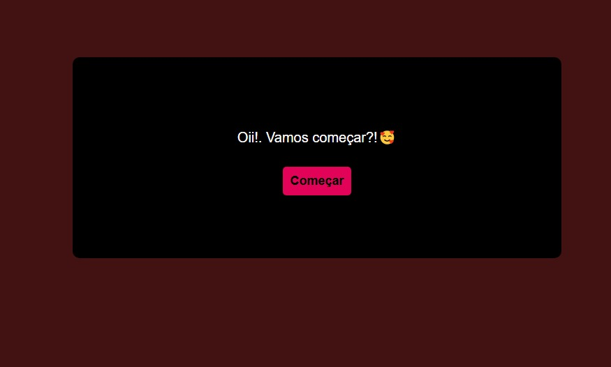

# Projeto de História Interativa

Este projeto foi criado utilizando Python para a lógica principal e adaptado para HTML, CSS e JavaScript para ser incorporado em meu portfólio de projetos. 

## Funcionalidades do Projeto

- **Python**: Utilizado para a lógica da história interativa, incluindo o controle de fluxo e decisões do usuário.
  
- **HTML**: Define a estrutura da página da história interativa, incluindo os elementos de texto, botões de escolha e ícones visuais.

- **CSS**: Responsável pelo estilo visual da história interativa, garantindo uma apresentação agradável e responsiva em diferentes dispositivos.

- **JavaScript**: Implementado para controlar a interatividade da página, incluindo atualizações dinâmicas de texto, manipulação de eventos de botão e animações.

## Estrutura do Projeto

- **rpg.html**: Arquivo principal que contém a estrutura HTML da história interativa.
  
- **styles.css**: Arquivo que define estilos visuais e de layout para a página da história.

- **script.js**: Arquivo JavaScript que implementa a lógica interativa e funcionalidades dinâmicas para a história.

- **python/**: Pasta que contém o código Python usado como base para a lógica da história interativa.

- **ico/**: Pasta que contém o ícone do site.

## Interagindo com o Programa 💬

O programa é interativo e o usuário pode tomar decisões clicando nos botões apresentados na interface gráfica. Cada decisão leva a uma nova parte da história e oferece novas opções para o usuário explorar. O objetivo é criar uma experiência divertida e envolvente para uma diversão para um casal.

#### Notas da Desenvolvedora por: Adrielle jcds

"Explorar este projeto foi uma jornada incrível para testar e melhorar minhas habilidades. Como adoro jogos, foi muito gratificante trabalhar em algo que me permite criar interações divertidas e envolventes. Se você gostou deste projeto e deseja usá-lo como inspiração ou em seus próprios trabalhos, por favor, dê os devidos créditos. Obrigada!"

